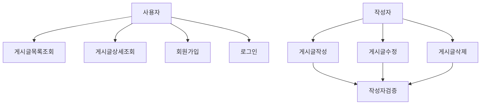

# Usecase 작성

```mermaid
graph TD;
    사용자 --> 게시글목록조회;
    사용자 --> 게시글상세조회;
    사용자 --> 회원가입;
    사용자 --> 로그인;
    작성자 --> 게시글작성 --> 작성자검증;
    작성자 --> 게시글수정 --> 작성자검증;
    작성자 --> 게시글삭제 --> 작성자검증;
    
    
```