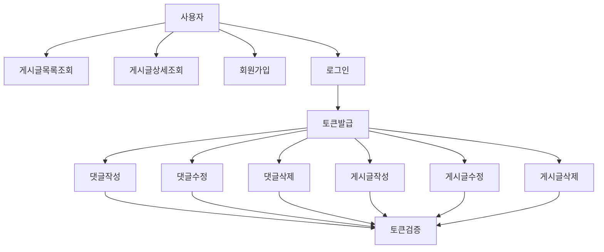

# Usecase 작성

```mermaid
graph TD;
    사용자 --> 게시글목록조회;
    사용자 --> 게시글상세조회;
    사용자 --> 회원가입;
    사용자 --> 로그인 --> 토큰발급;
    토큰발급 --> 댓글작성 --> 토큰검증;
    토큰발급 --> 댓글수정 --> 토큰검증;
    토큰발급 --> 댓글삭제 --> 토큰검증;
    토큰발급 --> 게시글작성 --> 토큰검증;
    토큰발급 --> 게시글수정 --> 토큰검증;
    토큰발급 --> 게시글삭제 --> 토큰검증;
    
    
```